# CivicTechExchange Architecture Guide

## Overview

CivicTechExchange is a Django + React web application that serves as a platform connecting skilled volunteers with civic technology projects. This guide provides a high-level architectural overview to help new developers understand the system structure, data flow, and key components.

## System Architecture

```mermaid
graph TB
    subgraph "Frontend Layer"
        USER[👤 User Browser]
        REACT[React Components]
        FLUX[Flux Stores]
        WEBPACK[Webpack Bundle]
    end
    
    subgraph "Backend Layer"
        DJANGO[Django Application]
        VIEWS[Django Views/API]
        MODELS[Django Models]
    end
    
    subgraph "Data Layer"
        POSTGRES[(PostgreSQL Database)]
        REDIS[(Redis Cache)]
        S3[AWS S3 Storage]
    end
    
    subgraph "External Services"
        OAUTH[OAuth Providers<br/>GitHub, Google, LinkedIn]
        EMAIL[Email Services]
        SALESFORCE[Salesforce CRM]
    end
    
    USER --> REACT
    REACT --> FLUX
    WEBPACK --> REACT
    REACT --> VIEWS
    VIEWS --> MODELS
    MODELS --> POSTGRES
    VIEWS --> REDIS
    VIEWS --> S3
    VIEWS --> EMAIL
    VIEWS --> SALESFORCE
    USER --> OAUTH
    OAUTH --> VIEWS
```

## Django App Structure

```mermaid
graph LR
    subgraph "Django Apps"
        DEMOCRACY[democracylab<br/>👥 User Management<br/>🔐 Authentication]
        CIVIC[civictechprojects<br/>📂 Projects<br/>🤝 Volunteers<br/>📊 Matching]
        COMMON[common<br/>🛠️ Shared Utils<br/>📋 Forms<br/>⚛️ Components]
        OAUTH[oauth2<br/>🔑 OAuth Providers]
        SALESFORCE[salesforce<br/>📈 CRM Integration]
    end
    
    DEMOCRACY --> CIVIC
    COMMON --> DEMOCRACY
    COMMON --> CIVIC
    OAUTH --> DEMOCRACY
    SALESFORCE --> CIVIC
```

### App Responsibilities

- **democracylab**: Core user management, authentication, signup/login flows, user profiles
- **civictechprojects**: Project CRUD, volunteer matching, groups, events, testimonials
- **common**: Shared components, utilities, forms, and React frontend components
- **oauth2**: OAuth authentication with GitHub, Google, LinkedIn, Facebook
- **salesforce**: Integration with Salesforce CRM for data synchronization

## Data Model Relationships

## Frontend Architecture

```mermaid
graph TB
    subgraph "React Frontend"
        MOUNT[mount-components.js<br/>🚀 Entry Point]
        MAIN[MainController<br/>🎮 App Router]
        SECTION[SectionController<br/>📄 Page Manager]
        
        subgraph "Component Types"
            CONTROLLERS[Controllers<br/>🎮 Page Logic]
            SECTIONS[componentsBySection<br/>📄 Page Specific]
            FORMS[forms<br/>📝 Form Components]
            COMMON_COMP[common<br/>🔧 Shared UI]
        end
        
        subgraph "State Management"
            FLUX_STORES[Flux Stores<br/>💾 State]
            DISPATCHER[UniversalDispatcher<br/>📡 Events]
        end
    end
    
    MOUNT --> MAIN
    MAIN --> SECTION
    SECTION --> CONTROLLERS
    SECTION --> SECTIONS
    CONTROLLERS --> FORMS
    CONTROLLERS --> COMMON_COMP
    CONTROLLERS --> FLUX_STORES
    FLUX_STORES --> DISPATCHER
```

### Frontend Components Structure

- **Controllers**: Handle page-level logic and routing (MainController, CreateProjectController, LogInController)
- **componentsBySection**: Page-specific components organized by site sections
- **forms**: Reusable form components (file uploads, links, validation)
- **common**: Shared UI components across the application
- **Flux Architecture**: Uses dispatcher pattern for state management

## API and Data Flow

## Key Features & Components

### 1. Project Management
- **Models**: `Project`, `ProjectPosition`, `ProjectFile`, `ProjectLink`
- **Features**: Create/edit projects, manage positions, file uploads, categorization with tags
- **Components**: CreateProjectController, project forms and sections

### 2. Volunteer Matching
- **Models**: `VolunteerRelation`, `Contributor`
- **Features**: Apply to projects, manage volunteer relationships, skill matching
- **Components**: Volunteer sections, user profiles

### 3. Groups & Events
- **Models**: `Group`, `Event`, `EventProject`, `RSVPVolunteerRelation`
- **Features**: Organize projects into groups, manage events, RSVP system
- **Components**: Group/Event creation and management forms

### 4. Tagging System
- **Models**: `Tag`, various `Tagged*` models
- **Features**: Categorize projects by issue areas, technologies, stages, organizations
- **Implementation**: Uses django-taggit with custom through models

### 5. Authentication & Users
- **Models**: `Contributor` (extends Django User)
- **Features**: OAuth login, user profiles, email verification
- **Providers**: GitHub, Google, LinkedIn, Facebook

## Development Workflow

```mermaid
graph LR
    subgraph "Development Process"
        CODE[👩‍💻 Code Changes]
        WEBPACK[📦 Webpack Build]
        STATIC[📁 collectstatic]
        SERVER[🖥️ Django Server]
    end
    
    subgraph "Build Commands"
        DEV[npm run dev]
        WATCH[npm run watch]
        BUILD[npm run build]
    end
    
    CODE --> WEBPACK
    WEBPACK --> STATIC
    STATIC --> SERVER
    
    DEV --> WEBPACK
    WATCH --> WEBPACK
    BUILD --> WEBPACK
```

### Key Development Commands

- **Frontend**: `npm run watch` for development, `npm run build` for production
- **Backend**: `python manage.py runserver` for local development
- **Testing**: `npm test` for React components, `python manage.py test` for Django
- **Database**: `python manage.py migrate` for schema changes

## Deployment Architecture

## Security & Performance

### Security Features
- CSRF protection on all forms
- Content Security Policy (CSP) headers
- OAuth-only authentication (no password storage)
- S3 signed URLs for secure file uploads
- Email verification for new users

### Performance Optimizations
- Redis caching for frequently accessed data
- Database query optimization with select_related/prefetch_related
- Static file CDN delivery via CloudFront
- Background job processing with django-rq
- Webpack code splitting and optimization

## Integration Points

### Third-Party Services
- **AWS S3**: File storage and CDN delivery
- **Redis**: Caching and background job queue
- **Salesforce**: CRM data synchronization
- **OAuth Providers**: Authentication (GitHub, Google, LinkedIn, Facebook)
- **Email Services**: Transactional emails and notifications
- **New Relic**: Application performance monitoring

### Data Synchronization
- Background jobs handle email notifications
- Salesforce integration for volunteer/project data
- Cache invalidation strategies for real-time updates
- File upload progress tracking

## Getting Started for New Developers

1. **Environment Setup**: Follow the [Contributor Guide](https://docs.google.com/document/d/1OLQPFFJ8oz_BxpuxRxKKdZ2brmlUkVN3ICTdbA_axxY/) for local development setup

2. **Key Files to Understand**:
   - `civictechprojects/models.py` - Core data models
   - `common/components/mount-components.js` - React app entry point
   - `democracylab/settings.py` - Django configuration
   - `civictechprojects/views.py` - Main API endpoints

3. **Common Development Tasks**:
   - Adding new React components: Place in `common/components/`
   - Creating API endpoints: Add to `civictechprojects/views.py` and `urls.py`
   - Database changes: Create migrations with `python manage.py makemigrations`
   - New features: Follow existing patterns for models → views → components

4. **Testing Strategy**:
   - React components: Jest tests in `common/components/test/`
   - Django functionality: Unit tests in `*/tests/` directories
   - Integration: Manual testing with local development server

This architecture supports DemocracyLab's mission of connecting civic-minded volunteers with meaningful technology projects, providing a scalable platform for community engagement and social impact.