# CivicTechExchange Frontend Modernization Assessment

## Executive Summary

The CivicTechExchange frontend represents a **classic mid-2019 React application** that would significantly benefit from modernization. While functionally sound, it suffers from considerable technical debt and lacks the developer experience and designer collaboration features that modern frontend stacks provide.

**Key Finding**: The frontend is a **strong candidate for modernization**, not replacement. The component structure is logical, the design system foundations exist, and the business logic is well-encapsulated.

---

## Current Frontend Stack Analysis

### Technology Stack Overview

| **Technology** | **Version** | **Status** | **Assessment** |
|---|---|---|---|
| React | 16.11.0 | 🔴 **Outdated** | Missing hooks, concurrent features, improved dev tools |
| Flux Architecture | 4.0.0 | 🔴 **Legacy** | Complex, hard to debug, no modern tooling |
| Webpack | 4.42.0 | 🔴 **Outdated** | Slow builds, limited HMR, security vulnerabilities |
| Node.js | 16.20.x | 🟡 **EOL Soon** | Still supported but approaching end-of-life |
| Sass/SCSS | ✅ **Good** | Well-structured, design system foundations |
| Bootstrap | 4.x | 🟡 **Older** | Missing modern component patterns |
| Flow | 0.75.0 | 🔴 **Abandoned** | Facebook deprecated, limited IDE support |

### Build and Development Workflow

**Current State:**
- **Webpack 4** with manual configuration
- **No Hot Module Replacement** - full page reloads
- **No development server** - relies on Django's runserver
- **Slow build times** - no modern optimization
- **Manual static file collection** via Django

**Developer Experience Issues:**
- **~30-60 second rebuilds** for small changes
- **Full page refreshes** lose component state
- **No component isolation** - can't develop components in isolation
- **Limited debugging tools** - no React DevTools integration with Flux

---

## Component Architecture Assessment

### Structure Analysis
- **261 total JS/JSX files** across the frontend
- **36+ Controller components** - well-organized page-level logic
- **Logical component hierarchy** - Controllers → Sections → Forms → Common
- **59 deprecated lifecycle methods** - significant modernization required

### Design Patterns

**Strengths:**
- **Clear separation of concerns** - Controllers handle pages, Sections handle features
- **Reusable form components** - LinkList, FileUploadList, CharacterCounter
- **Mount-based architecture** - allows React islands within Django templates

**Weaknesses:**
- **Class components throughout** - missing modern React patterns (hooks, function components)
- **Prop drilling** - data passed through multiple component layers
- **No component composition patterns** - render props, compound components, etc.
- **Manual DOM mounting** - each component requires individual mounting logic

---

## State Management Analysis

### Current Flux Implementation
- **Complex, hard-to-debug state flow**
- **EntitySearchStore** - 618 lines, doing too much (API calls + state + URL management)
- **Side effects in stores** - violates Flux principles, makes testing difficult
- **No action creators** - actions dispatched directly from components
- **Type safety with Flow** - but Flow is abandoned by Facebook

### Data Flow Issues
- **Scattered API calls** throughout stores
- **Tight coupling** between stores and components
- **Difficult testing** due to side effects
- **No middleware pattern** for async operations

---

## Styling and Design System Assessment

### Current Implementation

**Strengths:**
- **Comprehensive design system** - well-defined color scales, semantic variables
- **SCSS architecture** - modular, maintainable structure
- **Bootstrap foundation** - solid responsive grid and utilities
- **60+ component-specific SCSS files** - good organization

**Design System Foundations:**
```scss
// Strong color system with semantic naming
$color-text-strong: $color-neutral-90;
$color-background-accent: $color-brand-10;
$color-feedback-background-success-weakest: $color-green-10;
```

**Weaknesses:**
- **No CSS-in-JS integration** - styles divorced from components
- **No design tokens** - values hardcoded in SCSS
- **Bootstrap 4 limitations** - missing modern utility classes
- **No component library** - designers can't prototype with actual components

---

## Technical Debt Assessment

### High Priority Issues

1. **Deprecated React Patterns (59 instances)**
   - `componentWillMount`, `componentWillReceiveProps`, `componentWillUpdate`
   - **Risk**: Future React versions will remove these
   - **Impact**: Application will break with React 17+

2. **Flow Type System**
   - **Status**: Abandoned by Facebook in favor of TypeScript
   - **Risk**: No security updates, limited IDE support
   - **Impact**: Developer productivity declining

3. **Build System Performance**
   - **Webpack 4**: Missing tree shaking, code splitting optimizations
   - **No HMR**: Slow development feedback loop
   - **Security vulnerabilities** in dependencies

4. **State Management Complexity**
   - **EntitySearchStore**: Single store handling too many concerns
   - **Side effects in stores**: Difficult to test and debug
   - **No async patterns**: Ad-hoc API call handling

### Medium Priority Issues

1. **Component Architecture**
   - **Class components**: Missing modern React patterns
   - **Prop drilling**: Could benefit from context/state management
   - **Limited reusability**: Components tightly coupled to specific use cases

2. **Development Experience**
   - **No Storybook**: Designers can't work independently
   - **No component isolation**: Hard to develop/test components
   - **Limited tooling**: No modern React dev tools integration

---

## Modern Frontend Stack Options for CivicTechExchange

### Option 1: **Next.js + TypeScript + Tailwind CSS** ⭐ **RECOMMENDED**

**Why it fits CivicTechExchange:**
- **Civic tech needs SEO** - Next.js provides excellent SSR/SSG for project discovery
- **Designer-friendly** - Tailwind enables rapid prototyping and design system implementation
- **Performance critical** - Civic platforms need fast loading for broad accessibility
- **Developer productivity** - TypeScript + modern tooling = faster development

**Stack Details:**
```yaml
Framework: Next.js 14 (App Router)
Language: TypeScript
Styling: Tailwind CSS + Headless UI
State: Zustand + TanStack Query
Testing: Vitest + Testing Library
Storybook: Component development
Deployment: Vercel or continue with Heroku
```

**Designer Collaboration Benefits:**
- **Tailwind IntelliSense** - autocomplete design tokens in VS Code
- **Storybook integration** - designers can prototype with real components
- **Design tokens as code** - centralized theme configuration
- **Component-driven development** - build UI components first, wire logic later

**Migration Path:**
- **Phase 1**: New components in Next.js, keep existing Django templates
- **Phase 2**: Gradually migrate pages to Next.js
- **Phase 3**: Full SSG for static pages, API routes for dynamic content

---

### Option 2: **Vite + React + TypeScript + Styled Components**

**Why it fits:**
- **Fastest development** - Vite's HMR is instant
- **Component-scoped styles** - styled-components prevents CSS conflicts  
- **Gradual migration** - can integrate with existing Django setup
- **Strong TypeScript integration** - better than Webpack for TS

**Stack Details:**
```yaml
Build Tool: Vite
Framework: React 18
Language: TypeScript  
Styling: Styled Components + Emotion
State: Redux Toolkit + RTK Query
Testing: Vitest + Testing Library
Component Development: Storybook
```

**Trade-offs:**
- ✅ **Fastest HMR and build times**
- ✅ **Excellent TypeScript experience**  
- ❌ **No SSR/SSG** (unless adding separate framework)
- ❌ **More complex integration** with Django

---

### Option 3: **Remix + TypeScript + Stitches**

**Why it could work:**
- **Full-stack framework** - handles both frontend and API routes
- **Web standards focused** - progressive enhancement, accessibility built-in
- **Excellent performance** - optimized loading and data fetching
- **TypeScript-first** - excellent developer experience

**Stack Details:**
```yaml
Framework: Remix
Language: TypeScript
Styling: Stitches (CSS-in-JS with design tokens)
State: Built-in (less client state needed)
Testing: Vitest + Testing Library
```

**Trade-offs:**
- ✅ **Excellent web fundamentals** (accessibility, performance, SEO)
- ✅ **Less client-side complexity**
- ❌ **Biggest architectural change** from current setup
- ❌ **Smaller ecosystem** compared to Next.js

---

### Option 4: **Astro + React Islands** (Innovative Choice)

**Why it's interesting for civic tech:**
- **Island architecture** - ship minimal JavaScript, maximum performance
- **Component framework agnostic** - can use React, Vue, Svelte where needed
- **Content-focused** - excellent for civic tech platforms with lots of static content
- **Accessibility-first** - generates semantic HTML by default

**Stack Details:**
```yaml
Framework: Astro
Islands: React 18 (for interactive components)
Language: TypeScript
Styling: Tailwind CSS
Content: MDX for static pages
State: Nano stores for minimal client state
```

**Trade-offs:**
- ✅ **Best performance** possible - minimal JavaScript
- ✅ **Excellent SEO** and accessibility
- ✅ **Content-focused** architecture
- ❌ **Newer ecosystem** - less community support
- ❌ **Learning curve** for island architecture

---

## Designer-Friendly Workflow Recommendations

### Core Requirements for Designer Collaboration

1. **Component Library (Storybook)**
   - **Visual component development** - designers see components in isolation  
   - **Documentation integration** - props, usage examples, design guidelines
   - **Interactive playground** - designers can modify props and see changes
   - **Figma integration** - sync between design and code

2. **Design Token System**
   ```typescript
   // Centralized design tokens
   export const tokens = {
     colors: {
       brand: {
         50: '#fef5e6',
         500: '#f79e02',
         900: '#b0571b'
       }
     },
     spacing: {
       xs: '0.25rem',
       sm: '0.5rem',
       // ...
     }
   }
   ```

3. **Modern CSS Architecture**
   - **Utility-first CSS (Tailwind)** - designers can prototype directly in code
   - **Component variants** - systematic approach to component states
   - **Responsive design tokens** - consistent breakpoints and spacing

4. **Development Tools**
   - **Hot Module Replacement** - instant feedback during development
   - **Browser DevTools integration** - React/Vue DevTools
   - **Automated screenshot testing** - catch visual regressions
   - **Design system linting** - enforce design guidelines in code

### Recommended Designer-Developer Workflow

```mermaid
graph TB
    DESIGN[🎨 Designer creates in Figma] 
    TOKENS[📋 Design tokens extracted]
    STORY[📚 Developer creates Storybook stories]
    REVIEW[👥 Designer reviews in Storybook]
    IMPLEMENT[⚛️ Developer integrates components]
    
    DESIGN --> TOKENS
    TOKENS --> STORY
    STORY --> REVIEW
    REVIEW --> IMPLEMENT
    REVIEW --> TOKENS
```



---

## Migration Strategy Recommendation

### **Recommended Approach: Next.js Gradual Migration** 

**Phase 1: New Development (2-3 months)**
- Set up Next.js as separate frontend service
- Build new features in Next.js
- Proxy existing pages through Next.js
- Establish design system in Storybook

**Phase 2: Component Migration (3-4 months)** 
- Migrate reusable components to Next.js + TypeScript
- Implement new state management (Zustand + TanStack Query)
- Build comprehensive Storybook library
- Set up automated testing

**Phase 3: Page Migration (4-6 months)**
- Migrate high-traffic pages to Next.js
- Implement SSG for project/group listings
- Optimize performance and SEO
- Maintain Django API backend

**Phase 4: Full Migration (Optional)**
- Complete migration of remaining pages  
- Optimize bundle size and performance
- Implement advanced features (PWA, offline support)

### **Alternative: Vite In-Place Modernization**

**If Next.js migration seems too ambitious:**
- Replace Webpack with Vite (1-2 weeks)
- Migrate to TypeScript gradually
- Add Storybook for component development
- Implement modern state management
- **Faster to implement, but less long-term benefit**

---

## Questions for Stakeholders

1. **Priority Level**: Is frontend modernization a high priority, or should focus remain on backend API work?

2. **Designer Involvement**: Do you have designers who would actively use Storybook and component libraries?

3. **SEO Requirements**: How important is search engine optimization for project/group discovery?

4. **Performance Budget**: Are there specific performance requirements (page load times, mobile experience)?

5. **Accessibility Compliance**: Are there WCAG or other accessibility requirements?

6. **Mobile Strategy**: Is a mobile app planned, or should we optimize the web experience?

7. **Content Management**: Would content creators benefit from a headless CMS integration?

8. **Analytics and Tracking**: What user behavior tracking is required?

---

## Conclusion and Recommendations

### **Primary Recommendation: Next.js + TypeScript + Tailwind CSS**

This stack provides the best balance of:
- **Developer productivity** - modern tools and patterns
- **Designer collaboration** - Storybook + Tailwind workflow  
- **Performance** - SSG for civic tech content needs
- **Maintainability** - TypeScript + comprehensive testing
- **Future-proofing** - industry-standard, well-supported stack

### **Expected Outcomes**

After frontend modernization:
- **70-80% faster development cycles** with HMR and modern tooling
- **Designer-developer collaboration** through Storybook and design tokens
- **50%+ performance improvement** through modern bundling and SSG
- **Improved accessibility** with modern component patterns
- **Better SEO** for project and group discovery
- **Enhanced mobile experience** with responsive design system

### **Investment Justification**

The 6-month frontend modernization effort will:
- **Enable designer collaboration** - currently impossible with legacy stack
- **Accelerate feature development** - modern tooling and patterns
- **Improve user experience** - performance, accessibility, mobile
- **Future-proof the platform** - built on sustainable, modern foundations
- **Attract contributors** - modern stack appeals to volunteer developers

**Bottom Line**: The current frontend stack significantly hampers designer collaboration and development velocity. Modernization is **essential for long-term success** of the platform.

---

*Document Version: 1.0*  
*Last Updated: 2025-09-04*  
*Status: Assessment Complete*